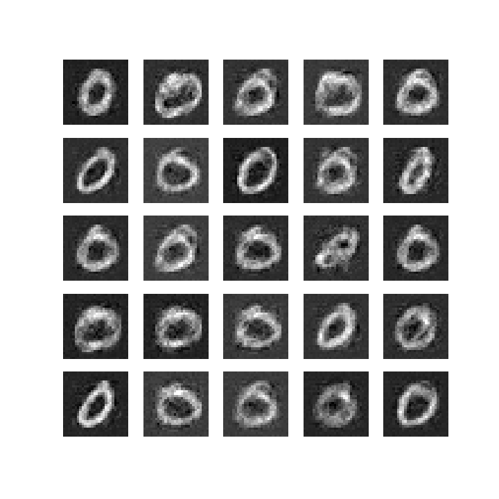

# GAN (Generative Adversarial Nets)

An implementation of Generative Adversarial Nets

## requirements
* python version : 3.5.6
* tensorflow version : 1.10.0

## Examples

## Discussion

* When optimizing to become balanced of generator and discriminator, the learning rate between generator and discriminator could set differently by user configuration. But it is quite difficult to make balanced between generator and discriminator.

* We can find mode collapsing problem on the example shown above. The model generated 0 in most cases. During several tests, the model generated no digits other than 0 and 8 in most cases.

## Reference
[Generative Adversarial Networks (Ian J. Goodfellow, et al.)[paper1]
[Common Problems  |  Generative Adversarial Networks][post1]

[paper1] : https://arxiv.org/pdf/1406.2661.pdf
[post1] : https://developers.google.com/machine-learning/gan/problems
